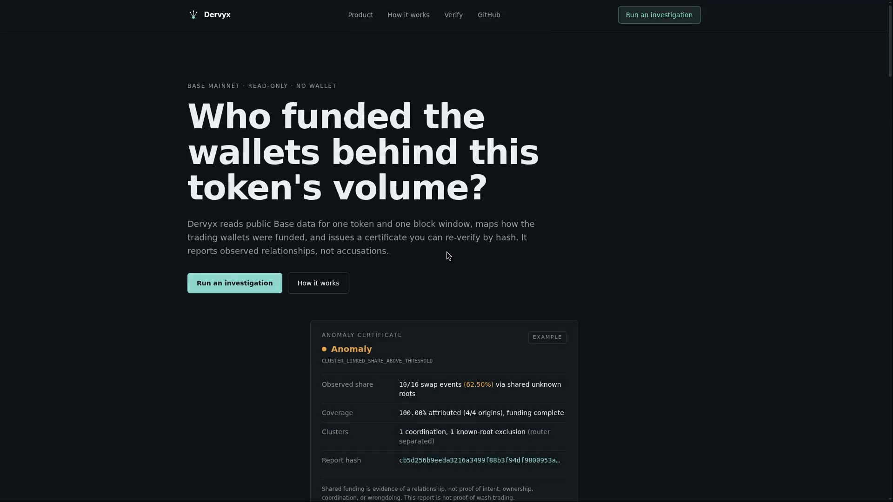
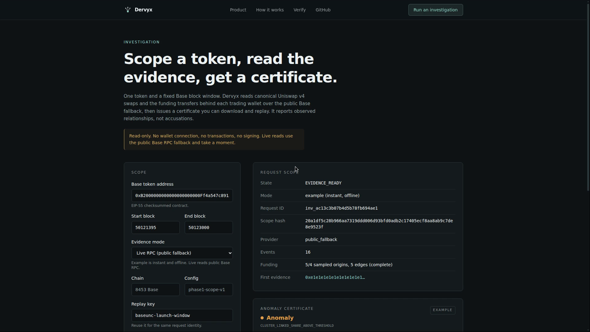

# Dervyx

Dervyx is a Base investigation agent built for launchpad teams. Before a token goes live or while early trading unfolds, give it one token and one fixed block window. It traces funding relationships behind observed swap activity, separates known infrastructure roots, and produces a certificate another reviewer can verify by hash.

[Open Dervyx](https://dervyx.vercel.app/) · [Run an investigation](https://dervyx.vercel.app/investigate) · [Run the paired proof](https://dervyx.vercel.app/compare) · [Agent contract](https://dervyx.vercel.app/api/agent) · [Check status](https://dervyx.vercel.app/status)

## Quick proof path

If you only have a few minutes, verify these four things:

1. Open the [paired proof](https://dervyx.vercel.app/compare).
2. Run the same scope twice: unknown shared root versus known router root.
3. Compare the attribution ledger and observed share.
4. Download the [anomaly certificate](./examples/anomaly-certificate.json), [anomaly receipt](./examples/anomaly-receipt.json), [control certificate](./examples/control-certificate.json), or [control receipt](./examples/control-receipt.json), then run `npm run verify:fixtures`.

The proof is the difference between a suspicious relationship and a sourced infrastructure relationship. Dervyx shows both.



## The problem

A token can show large volume while many trading wallets share a recent funding root. Reviewing that relationship usually means joining explorer transfers, DEX swaps, bridge activity, and wallet history by hand. Dervyx makes the scope explicit and returns the underlying evidence instead of an opaque risk score.

## How it works

1. **Scope** one Base token and a fixed block range.
2. **Read** canonical Uniswap v4 swap events and ERC-20 funding transfers.
3. **Trace** funding relationships up to two hops.
4. **Separate** known exchange, bridge, router, and market-maker roots from unknown roots.
5. **Ledger** every observed swap as unknown coordination, known infrastructure, attributed but unclustered, or unattributed.
6. **Certify** the observed share, coverage, exclusions, evidence links, and canonical JSON hash.
7. **Replay** the report in the browser or from the command line.

The optional model component may choose an allowlisted investigation branch from a sanitized summary. The deterministic engine owns every number, root classification, and verdict.

## Product flow



The live tool supports:

- Live Base RPC reads with provider mode shown explicitly
- A paired anomaly/control proof using the same deterministic engine and thresholds
- Source-linked evidence and BaseScan transaction links
- Downloadable JSON certificates
- Downloadable counterfactual evidence receipts
- Browser replay and hash verification
- A machine-readable agent contract at `/api/agent`
- Committed anomaly/control certificates and receipts that replay from a fresh checkout
- Retry and narrower-range guidance for incomplete evidence
- Explicitly bounded verified fixture scopes that fail closed when unsupported
- Explicit `ANOMALY`, `CLEAN`, `UNKNOWN_ROOTS`, and `INSUFFICIENT_DATA` states

## The counterfactual funding ledger

Dervyx does not hide legitimate connected activity behind a single score. Every certificate shows
what happened before and after the root policy:

- **Shared unknown roots** remain in the anomaly share.
- **Known infrastructure** stays visible but is excluded when the taxonomy has a sourced match.
- **Attributed, not clustered** activity has a funding path but does not meet the coordination rule.
- **Unattributed origins** remain outside the numerator when no accepted path was found.

The [paired proof](https://dervyx.159.69.241.122.sslip.io/compare) runs an anomaly fixture and a
known-router control with the same thresholds. The only meaningful change is the funding topology.
That makes the verdict inspectable as a policy decision, not a mysterious risk score. See the [proof walkthrough](./docs/DEMO.md) for the exact run and verification sequence.

The public [anomaly certificate](./examples/anomaly-certificate.json), [control certificate](./examples/control-certificate.json), [anomaly receipt](./examples/anomaly-receipt.json), and [control receipt](./examples/control-receipt.json) are labeled engine fixtures, not live-chain evidence.

## Evidence contract

| Result | Meaning |
|---|---|
| `ANOMALY` | A material observed share traces to a shared unknown funding root within the requested scope |
| `CLEAN` | The observed scope has complete attribution and no qualifying unknown-root coordination |
| `UNKNOWN_ROOTS` | Coverage is incomplete, so the evidence is inconclusive |
| `INSUFFICIENT_DATA` | The scope does not contain enough supported evidence to issue a result |

Shared funding is evidence of a relationship, not proof of intent, ownership, coordination, or wrongdoing. Dervyx does not claim to prove criminal wash trading.

## Quick start

Requirements: Node.js 22.23.x and npm.

```bash
npm ci
cp .env.example .env
npm run typecheck
npm run typecheck:web
npm test
npm run verify:fixtures
npm run build
npm start -- --hostname 127.0.0.1 --port 4760
```

Then open `http://127.0.0.1:4760/investigate`.

The production app runs as a Node.js Next.js server behind a Caddy reverse proxy. See [deployment notes](./docs/DEPLOYMENT.md).
The standalone `src/server.ts` HTTP boundary remains for engine-level tests and local replay; it is not the production deployment path.

## Environment

Copy `.env.example` to `.env`. The default chain connection and deterministic branch work without a model key. Keep `.env` local and untracked.

| Variable | Required | Purpose |
|---|---:|---|
| `BASE_RPC_URL` | No | Optional endpoint for public chain reads. |
| `NEXT_PUBLIC_SITE_URL` | No | Canonical URL used for social metadata. |
| `DERVYX_API_ORIGIN` | No | Optional API origin for a split Vercel frontend and stateful VPS backend. |
| `DERVYX_MODEL_BASE_URL` | No | OpenAI-compatible chat-completions base URL for optional branch selection. |
| `DERVYX_MODEL_API_KEY` | No | Local-only key for the optional model adapter. |
| `DERVYX_MODEL_NAME` | No | Model name for the optional branch selector. |
| `DERVYX_MODEL_TIMEOUT_MS` | No | Bounded model timeout. Defaults to 8000 ms. |

## Verification

The current release has been verified with:

- `npm run typecheck`
- `npm run typecheck:web`
- `npm test`, 64 tests passing
- `npm run verify:fixtures`, replaying both committed proof certificates and receipts
- `npm run build`
- `npm audit --audit-level=high`
- Live `/api/health`, `/status`, and `/investigate` checks
- Browser completion of the paired anomaly/control proof
- Browser replay verification of the generated certificate
- `npm run verify:report -- report.json` for fresh-clone report replay

## Honest limitations

- Base mainnet is the first supported chain.
- The default chain connection is public and its coverage is labeled as such.
- The primary workflow is analysis. Dervyx does not connect a wallet, sign, send transactions, or move funds.
- The paired example mode is synthetic but clearly labeled and runs through the same engine. It is not live-chain evidence.
- The current adapter supports a bounded set of verified Base token/pool fixtures. Unsupported token scopes fail closed rather than guessing a pool.
- Configured RPC URLs are redacted from evidence, reports, receipts, and normalized source metadata.
- Funding coverage can be partial. Partial evidence never becomes a clean result.
- A running process keeps request state in memory. Restarting the server clears active investigation records.
- The product reports observable relationships. Human reviewers decide what those relationships mean.
- Public scope creation and live evidence reads are rate-limited; live work is also concurrency-bounded.

## Orion Builder Hackathon

Dervyx is prepared for the [Orion Builder Hackathon](https://orionagents.org/hackathon). The application is self-contained and makes no unsupported claim about a private Orion runtime API or native platform integration.

This release has no wallet flow and no attestation contract. Orion registration, wallet signature, ignition payment, and submission are separate owner-controlled actions and are not performed by this repository.

## Repository layout

```text
app/                 Next.js pages and API route handlers
app/compare/         Paired anomaly/control proof route
components/          Product UI and certificate components
lib/                 Next.js orchestration and labeled examples
src/                 Deterministic scope, evidence, graph, report, receipt, and engine code
test/                Engine and HTTP tests
examples/             Replayable anomaly/control certificates and receipts
fixtures/             Phase 0 input manifest
scripts/              Replay and report-audit utilities
public/screenshots/  Verified product screenshots
```

## Agent contract

`GET /api/agent` returns the current machine-readable contract: Base chain identity, supported
states and verdicts, safety guarantees, input/output tools, committed fixture paths, public
limits, and known limitations. It is a small HTTP/JSON interoperability surface for other agents
and does not claim a private Orion SDK integration.

## License

[MIT License](./LICENSE)
